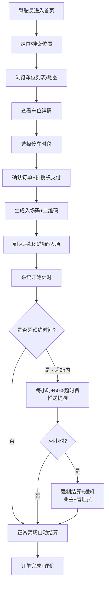
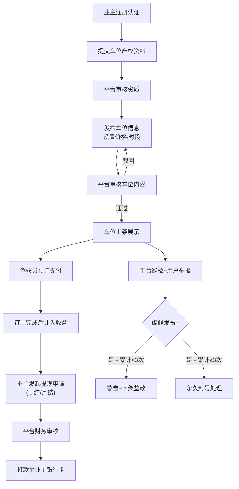

## 1. 产品概述

共享停车位出租与管理平台是一个连接车位闲置业主与临时停车需求驾驶员的智慧共享平台。通过数字化手段盘活城市闲置车位资源，解决城市中心区停车难、车位利用率低的社会痛点。
- 核心目标：构建"车主-平台-驾驶员"三方共赢生态，提升车位使用效率，降低停车成本，规范停车秩序
- 市场价值：响应城市智慧交通战略，为千万级城市车位资源优化配置提供技术解决方案

## 2. 核心功能

### 2.1 用户角色

| 角色 | 注册方式 | 核心权限 |
|------|----------|----------|
| 驾驶员 | 手机号注册+实名认证 | 搜索车位、预订支付、扫码入场、订单管理、评价反馈 |
| 车位业主 | 手机号注册+实名认证+车位产权认证 | 发布车位、设置价格时段、出租记录查询、收益提现、纠纷申诉 |
| 平台管理员 | 后台专属账号 | 车位审核、纠纷处理、违规处罚、数据看板、用户管理、系统配置 |

### 2.2 功能模块

1. **驾驶员端首页**：位置定位、车位搜索、推荐车位、热门区域、个人入口
2. **车位搜索与列表**：地图/列表模式、筛选排序、车位详情、价格预估
3. **预订与支付**：时段选择、价格计算、在线支付、入场码生成
4. **订单管理**：进行中订单、历史订单、入场/离场操作、超时提醒、评价
5. **业主端工作台**：车位概览、收入统计、今日收益、快捷操作
6. **车位发布与管理**：发布表单、时段设置、价格配置、车位上下架
7. **出租记录与收入**：订单明细、收益报表、周/月提现、提现记录
8. **平台管理后台**：车位审核、纠纷处理、违规管理、用户管理
9. **数据看板**：区域空置率、高峰时段分析、收入排行、运营指标

### 2.3 页面详情

| 页面名称 | 模块名称 | 功能描述 |
|----------|----------|----------|
| 驾驶员首页 | 定位搜索区 | 自动获取当前位置，支持手动输入目的地搜索 |
| 驾驶员首页 | 推荐车位卡片 | 展示附近优质车位，显示距离、价格、评分 |
| 驾驶员首页 | 热门区域快捷入口 | 商圈/写字楼/小区热门区域一键搜索 |
| 车位列表页 | 地图模式 | 地图标注车位位置，聚合显示，点击查看详情 |
| 车位列表页 | 列表模式 | 列表展示车位信息，支持距离/价格/评分排序 |
| 车位列表页 | 筛选面板 | 价格区间、时段、充电设施、无障碍等筛选条件 |
| 车位详情页 | 车位信息卡片 | 位置、图片、设施、价格、评分、业主信息 |
| 车位详情页 | 时段选择器 | 日历+时间轴选择起止时段，实时显示价格 |
| 车位详情页 | 预订确认 | 订单摘要、支付方式选择、预授权说明 |
| 订单进行中 | 入场码展示 | 6位数字入场码+二维码，倒计时显示 |
| 订单进行中 | 计时状态 | 实时显示已停时长、预计费用，一键开门按钮 |
| 订单进行中 | 超时提醒条 | 超预约时间后显示超时警告和费用提示 |
| 订单历史页 | 订单列表 | 按时间分组展示历史订单，支持筛选和搜索 |
| 业主工作台 | 数据概览卡片 | 总车位、今日订单、累计收入、本月收益 |
| 业主工作台 | 收益趋势图 | 近7天/30天收益折线图、柱状图对比 |
| 车位管理页 | 车位列表 | 卡片展示所有车位，状态标签、快捷操作 |
| 车位发布页 | 发布表单 | 基础信息、位置地图标注、图片上传、时段设置、价格配置 |
| 出租记录页 | 订单明细表 | 所有出租订单，状态筛选、导出Excel |
| 收入提现页 | 收益统计 | 可提现金额、累计收益、待结算金额 |
| 收入提现页 | 提现申请 | 提现金额输入、银行卡选择、到账时间说明 |
| 平台审核页 | 待审核车位列表 | 车位信息+产权资料，通过/驳回操作 |
| 纠纷处理页 | 纠纷工单列表 | 纠纷类型、状态、双方证据、处理操作 |
| 违规管理页 | 违规记录列表 | 用户违规记录、处罚操作、封号处理 |
| 数据看板页 | 区域空置率热力图 | 按行政区域展示车位空置率分布 |
| 数据看板页 | 高峰时段图 | 24小时/7天车位占用率趋势图 |
| 数据看板页 | 收入排行榜 | 业主/区域/车位维度收入TOP榜单 |
| 登录注册页 | 角色选择 | 驾驶员/业主身份切换，手机号验证码登录 |

## 3. 核心流程

### 3.1 驾驶员租车位流程
用户打开App后自动定位当前位置，输入目的地或使用当前位置搜索附近可用车位。浏览车位列表或地图模式，查看车位详情（位置、图片、设施、价格、评价）。选择需要的停车时段，系统实时计算预估价格和预授权金额。选择支付方式完成在线支付和预授权冻结。系统生成6位入场码和二维码。到达停车场后，输入入场码或扫描二维码开启道闸。系统自动记录入场时间开始计时。离场时系统自动检测出场，计算实际停车时长和费用，从预授权中扣除，超出预约时段按超时规则计费：超2小时内每小时加收50%超时费，推送超时提醒；超4小时强制结算并通知业主和平台管理员。支付完成后可对本次停车体验进行评价。

### 3.2 业主出租与提现流程
业主完成实名认证和车位产权认证后，发布车位信息，设置位置、图片、可用时段、小时价格、日封顶价等。车位经平台审核通过后上架展示。驾驶员预订车位后，业主可在后台查看订单状态和实时收益。可按周或月发起提现申请，平台审核后将收益转账至业主绑定银行卡。如业主连续3次发布虚假车位信息，平台将自动封号处理。

## 4. 用户界面设计

### 4.1 设计风格

- **主色调**：深海蓝 (#1e3a5f) 作为品牌主色，传递专业、信任、科技感；搭配活力橙 (#ff6b35) 作为行动点缀色，用于按钮、价格、重点提示
- **辅助色**：成功绿 (#10b981)、警示黄 (#f59e0b)、危险红 (#ef4444)、中性灰阶 (#64748b - #f8fafc)
- **按钮风格**：圆角8px，主按钮使用渐变蓝+微悬浮阴影，次按钮使用描边+悬停填充
- **字体选型**：标题使用"思源黑体 Heavy"，正文使用"思源黑体 Regular/Medium"，数字价格使用"JetBrains Mono"等宽字体以增强可读性
- **布局风格**：卡片式布局+微毛玻璃效果，顶部导航栏使用半透明磨砂背景，内容区域使用错落有致的卡片组合，配合留白营造呼吸感
- **图标风格**：使用统一线条粗细的线性图标，配合色彩渐变填充，关键数据使用微3D拟物化卡片

### 4.2 页面设计概览

| 页面名称 | 模块名称 | UI元素 |
|----------|----------|--------|
| 驾驶员首页 | Hero搜索区 | 大圆角搜索框+定位图标，背景使用城市夜景渐变+微噪点纹理 |
| 驾驶员首页 | 推荐车位卡片 | 悬浮卡片+车位缩略图，价格标签使用橙色渐变胶囊标签 |
| 车位详情页 | 车位图片轮播 | 圆角大图+指示器，入场动画从下往上淡入 |
| 车位详情页 | 时段选择器 | 日历使用选中日期高亮，时间轴用拖拽式滑块选择起止时间 |
| 订单进行中 | 入场码区域 | 大号数字等宽字体，二维码居中展示，背景深蓝+发光效果 |
| 业主工作台 | 数据卡片 | 毛玻璃背景+渐变边框，数字使用大字号加粗+渐变色 |
| 业主工作台 | 收益趋势图 | 平滑曲线面积图，数据点悬停显示详情弹窗 |
| 数据看板 | 区域热力图 | 色块深浅表示空置率，鼠标悬停显示区域名称和具体数值 |
| 数据看板 | 收入排行榜 | 前三名使用金/银/铜奖杯图标，列表行使用斑马纹区分 |

### 4.3 响应式设计

- 采用桌面端优先设计，主内容区最大宽度1440px居中展示
- 平板端(768-1024px)：侧边栏收起为抽屉式，卡片网格从4列转为2列
- 移动端(<768px)：导航转为底部TabBar，卡片单列瀑布流，搜索框全宽固定顶部
- 地图组件全平台自适应，触摸设备支持双指缩放和单指拖动
- 表单元素在移动端自动增大点击区域至44px最小尺寸

### 4.4 动效与交互

- 页面入场：采用分阶段延迟动画(50ms间隔)，卡片依次从下往上淡入位移
- 按钮交互：按下时缩放至0.97，松开回弹，主按钮附带蓝色光晕涟漪
- 数据刷新：数字从旧值平滑滚动过渡到新值，进度条填充使用缓动曲线
- 超时提醒：超时状态条从顶部滑入并带有脉冲呼吸效果，颜色从黄色渐变为红色
- 地图标注：车位图标悬浮时放大1.2倍并弹出信息气泡
