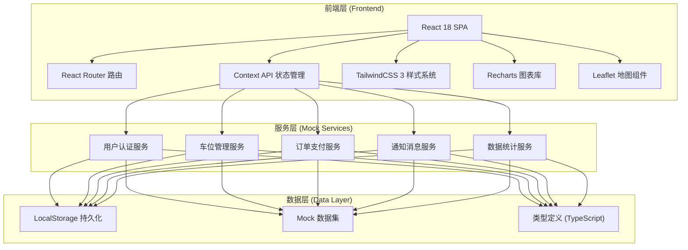
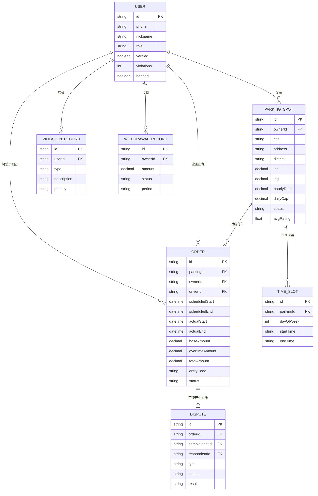

## 1. 架构设计



## 2. 技术描述

- **前端框架**：React@18 + TypeScript@5，使用函数组件+Hooks
- **构建工具**：Vite@5，提供极速热更新和生产构建
- **样式方案**：TailwindCSS@3，配合自定义设计Token和CSS变量
- **路由管理**：React Router@6，支持嵌套路由和角色权限路由守卫
- **状态管理**：React Context + useReducer，分模块管理全局状态
- **图表可视化**：Recharts@2，实现数据看板的各类图表
- **地图组件**：Leaflet@1.9 + OpenStreetMap，车位位置标注和搜索
- **二维码生成**：qrcode.react@3，生成入场码二维码
- **图标库**：Lucide React，统一线性风格图标
- **数据持久化**：localStorage + 自定义加密工具
- **后端方案**：纯前端Mock实现，内置完整模拟数据集，支持未来对接真实API

## 3. 路由定义

| 路由路径 | 页面组件 | 权限角色 | 用途说明 |
|----------|----------|----------|----------|
| /login | LoginPage | public | 登录注册，角色切换 |
| / | DriverHomePage | driver | 驾驶员首页：定位+车位搜索 |
| /search | SearchPage | driver | 车位搜索结果：列表+地图 |
| /parking/:id | ParkingDetailPage | driver | 车位详情：时段选择+预订 |
| /payment/:orderId | PaymentPage | driver | 支付页面：预授权+在线支付 |
| /order/active | ActiveOrderPage | driver | 进行中订单：入场码+计时 |
| /orders | OrderHistoryPage | driver | 历史订单列表 |
| /driver/profile | DriverProfilePage | driver | 驾驶员个人中心 |
| /owner/dashboard | OwnerDashboardPage | owner | 业主工作台：数据概览 |
| /owner/parkings | OwnerParkingListPage | owner | 业主车位管理列表 |
| /owner/parking/publish | OwnerPublishPage | owner | 发布新车位表单 |
| /owner/parking/edit/:id | OwnerPublishPage | owner | 编辑已有车位 |
| /owner/orders | OwnerOrdersPage | owner | 出租订单记录 |
| /owner/finance | OwnerFinancePage | owner | 收入统计与提现 |
| /admin/audit | AdminAuditPage | admin | 车位审核列表 |
| /admin/disputes | AdminDisputesPage | admin | 纠纷处理工单 |
| /admin/violations | AdminViolationsPage | admin | 违规处罚管理 |
| /admin/dashboard | AdminDashboardPage | admin | 运营数据看板 |
| /admin/users | AdminUsersPage | admin | 用户管理列表 |
| * | NotFoundPage | public | 404页面 |

## 4. 核心数据结构与API定义

### 4.1 TypeScript 类型定义

```typescript
// 用户角色枚举
enum UserRole { DRIVER = 'driver', OWNER = 'owner', ADMIN = 'admin' }

// 用户基础信息
interface User {
  id: string;
  phone: string;
  nickname: string;
  avatar: string;
  role: UserRole;
  realName?: string;
  idCard?: string;
  verified: boolean;
  violations: number;
  banned: boolean;
  createdAt: string;
}

// 车位信息
interface ParkingSpot {
  id: string;
  ownerId: string;
  title: string;
  address: string;
  district: string;
  lat: number;
  lng: number;
  images: string[];
  description: string;
  facilities: string[];
  hourlyRate: number;
  dailyCap: number;
  availableSlots: TimeSlot[];
  status: 'pending' | 'approved' | 'rejected' | 'offline';
  avgRating: number;
  totalBookings: number;
  auditReason?: string;
  createdAt: string;
}

// 时段配置
interface TimeSlot {
  dayOfWeek: number;
  startTime: string;
  endTime: string;
}

// 订单信息
interface Order {
  id: string;
  parkingId: string;
  parkingTitle: string;
  ownerId: string;
  driverId: string;
  scheduledStart: string;
  scheduledEnd: string;
  actualStart?: string;
  actualEnd?: string;
  scheduledHours: number;
  actualHours?: number;
  overtimeHours?: number;
  baseAmount: number;
  overtimeAmount: number;
  totalAmount: number;
  preAuthAmount: number;
  entryCode: string;
  status: 'pending' | 'paid' | 'active' | 'completed' | 'cancelled' | 'disputed';
  paymentMethod: string;
  paymentTime?: string;
  disputeReason?: string;
  rating?: number;
  review?: string;
  createdAt: string;
}

// 违规记录
interface ViolationRecord {
  id: string;
  userId: string;
  type: 'fake_listing' | 'overstay' | 'payment_default' | 'abuse';
  description: string;
  evidence: string[];
  penalty: 'warning' | 'suspend' | 'ban';
  createdAt: string;
}

// 纠纷工单
interface Dispute {
  id: string;
  orderId: string;
  complainantId: string;
  respondentId: string;
  type: 'quality' | 'refund' | 'overcharge' | 'other';
  description: string;
  evidences: { userId: string; content: string; type: 'text' | 'image' }[];
  status: 'open' | 'processing' | 'resolved' | 'closed';
  result?: string;
  createdAt: string;
}

// 提现记录
interface WithdrawalRecord {
  id: string;
  ownerId: string;
  amount: number;
  bankName: string;
  bankAccount: string;
  status: 'pending' | 'approved' | 'rejected' | 'completed';
  period: 'weekly' | 'monthly';
  startDate: string;
  endDate: string;
  processedAt?: string;
  createdAt: string;
}
```

### 4.2 Mock API 服务方法

```typescript
// 用户认证服务
interface AuthService {
  login(phone: string, code: string, role: UserRole): Promise<{ token: string; user: User }>;
  sendSmsCode(phone: string): Promise<boolean>;
  register(data: RegisterData): Promise<User>;
  submitRealNameAuth(userId: string, data: RealNameData): Promise<boolean>;
  getCurrentUser(): Promise<User | null>;
  logout(): void;
}

// 车位服务
interface ParkingService {
  searchParkings(params: SearchParams): Promise<{ list: ParkingSpot[]; total: number }>;
  getParkingById(id: string): Promise<ParkingSpot | null>;
  publishParking(ownerId: string, data: ParkingFormData): Promise<ParkingSpot>;
  updateParking(id: string, data: ParkingFormData): Promise<ParkingSpot>;
  toggleParkingStatus(id: string, status: 'approved' | 'offline'): Promise<boolean>;
  auditParking(id: string, result: 'approved' | 'rejected', reason?: string): Promise<boolean>;
  getPendingAudits(): Promise<ParkingSpot[]>;
  getOwnerParkings(ownerId: string): Promise<ParkingSpot[]>;
}

// 订单服务
interface OrderService {
  createOrder(driverId: string, data: OrderCreateData): Promise<Order>;
  payOrder(orderId: string, method: string): Promise<Order>;
  getActiveOrder(driverId: string): Promise<Order | null>;
  enterParking(orderId: string, entryCode: string): Promise<Order>;
  exitParking(orderId: string): Promise<Order>;
  getDriverOrders(driverId: string, status?: string): Promise<Order[]>;
  getOwnerOrders(ownerId: string): Promise<Order[]>;
  reviewOrder(orderId: string, rating: number, review: string): Promise<boolean>;
  cancelOrder(orderId: string): Promise<boolean>;
}

// 财务服务
interface FinanceService {
  getOwnerFinanceSummary(ownerId: string): Promise<FinanceSummary>;
  getIncomeTrend(ownerId: string, period: '7d' | '30d'): Promise<IncomePoint[]>;
  requestWithdrawal(ownerId: string, amount: number, period: 'weekly' | 'monthly'): Promise<WithdrawalRecord>;
  getWithdrawalHistory(ownerId: string): Promise<WithdrawalRecord[]>;
  processWithdrawal(id: string, result: 'approved' | 'rejected'): Promise<boolean>;
}

// 管理员服务
interface AdminService {
  getDashboardStats(): Promise<DashboardStats>;
  getDistrictVacancyRates(): Promise<DistrictData[]>;
  getPeakHourData(): Promise<HourData[]>;
  getRevenueRanking(dimension: 'owner' | 'district' | 'parking'): Promise<RankingItem[]>;
  getDisputeList(status?: string): Promise<Dispute[]>;
  processDispute(id: string, result: string): Promise<Dispute>;
  getViolationList(): Promise<ViolationRecord[]>;
  addViolation(userId: string, data: ViolationData): Promise<ViolationRecord>;
  getUserList(role?: UserRole): Promise<User[]>;
  toggleUserBan(userId: string, banned: boolean): Promise<boolean>;
}
```

## 5. 数据模型 ER 图



## 6. 目录结构

```
src/
├── assets/                  # 静态资源
│   ├── images/              # 图片资源
│   └── styles/              # 全局样式
├── components/              # 通用组件
│   ├── layout/              # 布局组件(Header/Sidebar/Footer)
│   ├── common/              # 通用组件(Button/Card/Modal/Toast)
│   ├── parking/             # 车位相关组件
│   ├── order/               # 订单相关组件
│   └── charts/              # 图表组件
├── contexts/                # Context状态管理
│   ├── AuthContext.tsx      # 用户认证状态
│   ├── ParkingContext.tsx   # 车位数据状态
│   └── OrderContext.tsx     # 订单数据状态
├── hooks/                   # 自定义Hooks
│   ├── useAuth.ts
│   ├── useParking.ts
│   └── useTimer.ts
├── pages/                   # 页面组件
│   ├── login/               # 登录注册
│   ├── driver/              # 驾驶员端页面
│   ├── owner/               # 业主端页面
│   └── admin/               # 管理员端页面
├── services/                # Mock API服务层
│   ├── authService.ts
│   ├── parkingService.ts
│   ├── orderService.ts
│   ├── financeService.ts
│   └── adminService.ts
├── data/                    # Mock数据集
│   ├── users.ts
│   ├── parkings.ts
│   ├── orders.ts
│   └── adminData.ts
├── types/                   # TypeScript类型定义
│   ├── index.ts
│   └── api.ts
├── utils/                   # 工具函数
│   ├── storage.ts
│   ├── format.ts
│   ├── time.ts
│   ├── geo.ts
│   └── idGenerator.ts
├── routes/                  # 路由配置
│   ├── index.tsx
│   └── PrivateRoute.tsx
├── App.tsx                  # 根组件
├── main.tsx                 # 入口文件
└── vite-env.d.ts
```
